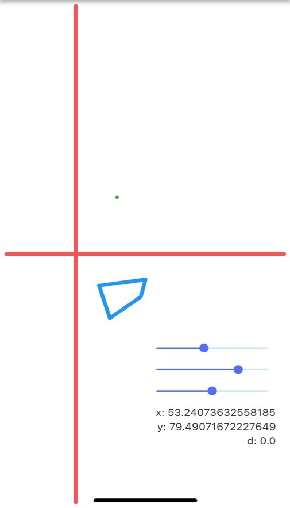
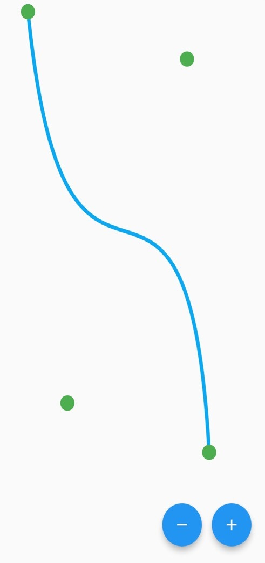
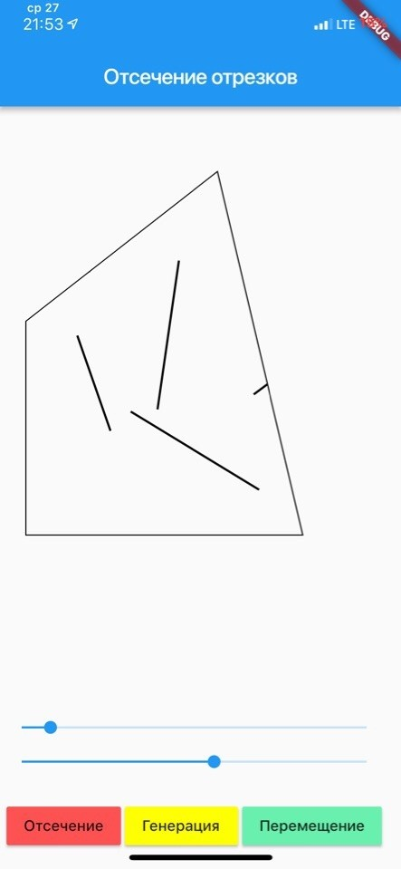
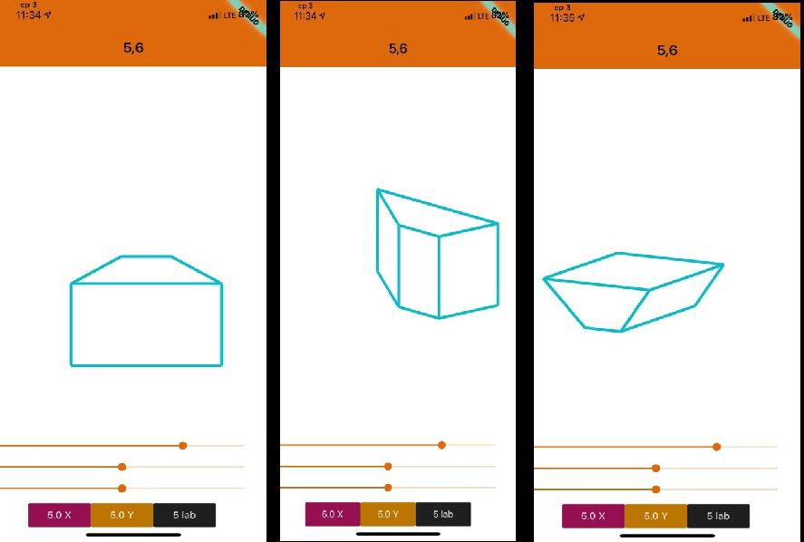
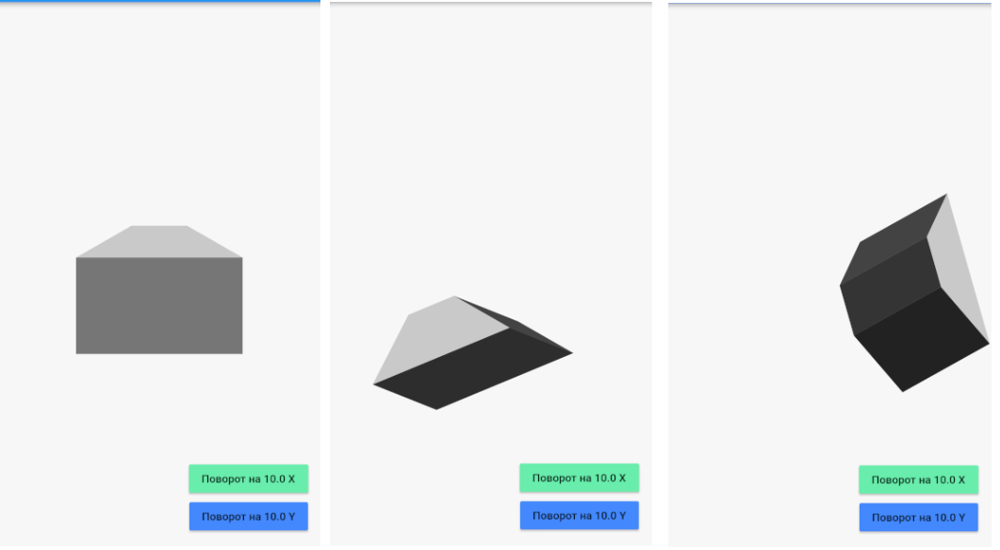

# Computer-graphics
 3 курс | Компьютерная графика | Лектор Лячек

# ATTENTION! В отчетах нет кода, исходники где-то на компе лежат, всё было вставлять не нужно, а хоть что-то для вида. Могу скинуть, если найду.

# 1 лаба: Поворот вокруг точки

# 2 лаба: Кривая Безье

# 3 лаба: Билинейная поверхность

# 4 лаба: Отсечение отрезков (Clipper)

# 5 лаба: Скрытие невидимых граней

# 6 лаба: Источник света

